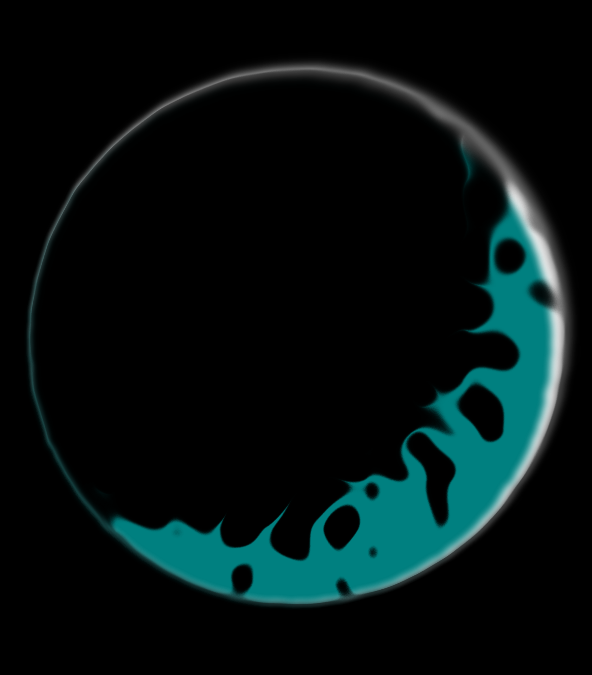

# graviton

A simple gravitational simulatoy. [skepsi.me/graviton](http://skepsi.me/graviton)

## Development

Get the code and install the Node packages.

  git clone https://github.com/voithos/graviton.git
  cd graviton
  npm install

Then just run `gulp` to build and serve the app locally!

## Attribution

Graviton is mostly self-contained, but does depend upon the following
libraries:

- Vex.js, for the dialogs
- jscolor, for the color picker

In addition, most of the icons are taken from the Material icon set.

Thanks go to their creators, and also to the web platform itself.
